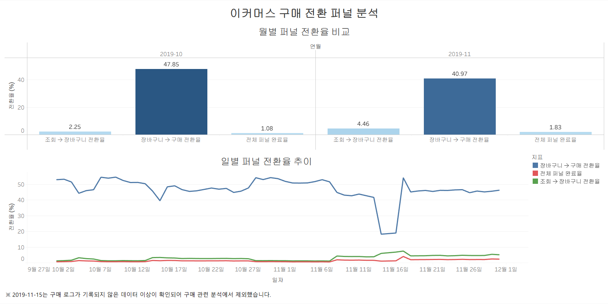
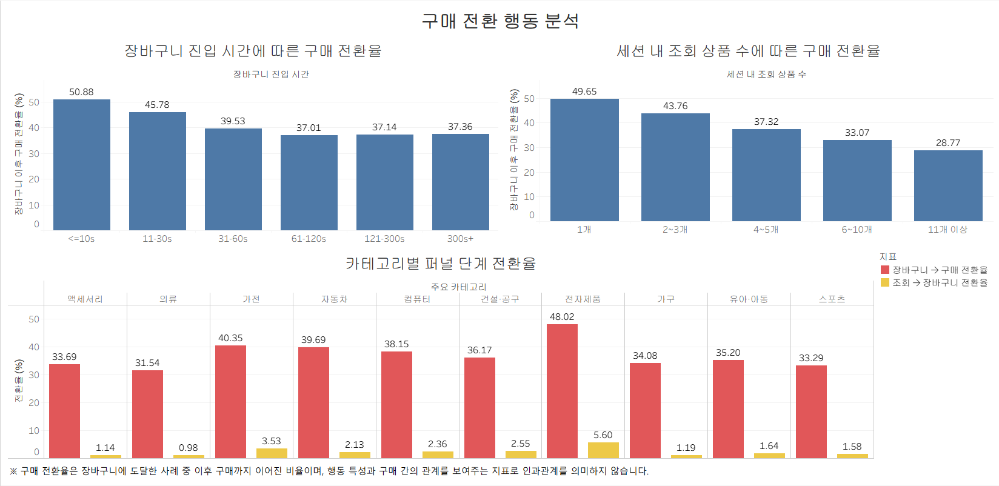
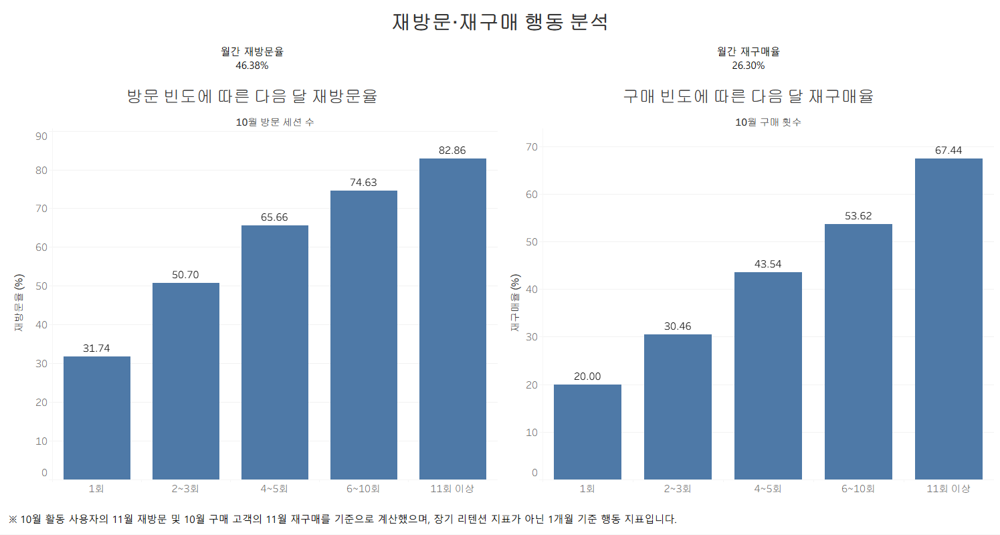

  # 이커머스 사용자 행동 기반 구매 전환 및 이탈 분석

  ## 1. 프로젝트 개요

  약 **1.1억 건의 이커머스 사용자 행동 로그**를 활용하여
  상품 조회(View) → 장바구니(Cart) → 구매(Purchase) 과정의 전환 구조와 구매 이탈 행동을 분석한 프로젝트입니다.

  단순 이벤트 수를 집계하는 방식에서 벗어나 `user_session × product_id` 단위로 사용자의 행동 순서를 재구성하여 퍼널을 정의하고, 장바구니 이탈, 세션 행동, 카테고리별 전환 차이, 월간 재방문 및 재구매 패턴을 분석했습니다.

  또한 분석 과정에서 **2019-11-15의 구매 이벤트가 하루 전체에서 0건으로 기록된 데이터 품질 이상**을 발견하고, 포함/제외 결과를 비교한 뒤 구매 관련 주요 분석에서는 해당 날짜를 제외했습니다.

  ---

  ## 2. 분석 목표

  본 프로젝트에서는 다음 질문에 답하는 것을 목표로 했습니다.

  1. 조회 → 장바구니 → 구매 과정에서 가장 큰 이탈은 어느 단계에서 발생하는가?
  2. 장바구니에 도달한 사용자의 어떤 행동 특성이 구매 여부와 관련되어 있는가?
  3. 세션 행동에 따라 구매 가능성은 어떻게 달라지는가?
  4. 카테고리별로 전환 구조에 차이가 존재하는가?
  5. 한 달 동안의 방문·구매 빈도와 다음 달 재방문·재구매에는 어떤 관계가 있는가?

  ---

  ## 3. 데이터셋

  본 프로젝트에서는 **REES46 / Open CDP Multi-category Store eCommerce Behavior** 데이터를 사용했습니다.

  * 분석 기간: **2019년 10월 ~ 2019년 11월**
  * 총 이벤트 수: **109,950,743건**
  * 고유 사용자 수: **5,316,649명**
  * 고유 세션 수: **23,016,650개**
  * 주요 이벤트 유형

    * `view`: 상품 조회
    * `cart`: 장바구니 추가
    * `purchase`: 구매

  ### 주요 컬럼

  | 컬럼              | 설명                                 |
  | --------------- | ---------------------------------- |
  | `event_time`    | 사용자 행동 발생 시각                       |
  | `event_type`    | 행동 유형 (`view`, `cart`, `purchase`) |
  | `product_id`    | 상품 ID                              |
  | `category_id`   | 카테고리 ID                            |
  | `category_code` | 계층형 카테고리 코드                        |
  | `brand`         | 브랜드                                |
  | `price`         | 이벤트 발생 시점의 상품 가격                   |
  | `user_id`       | 사용자 ID                             |
  | `user_session`  | 방문 세션 ID                           |

  > 원본 데이터는 대용량 파일이므로 GitHub 저장소에는 포함하지 않고 데이터 출처만 제공합니다.

  ---

  ## 4. 분석 환경 및 기술 스택

  ### DuckDB

  * 약 1.1억 건 규모의 Parquet 데이터를 SQL로 직접 조회
  * 대규모 행동 로그의 반복 집계 및 퍼널 분석 수행
  * 로컬 환경에서 분석성 쿼리를 효율적으로 처리하기 위해 사용

  ### Python / Jupyter Notebook

  * 분석 코드 실행 및 결과 검증
  * 데이터 가공 및 Tableau용 집계 데이터 생성

  ### Parquet

  * 원본 CSV를 컬럼 기반 파일 형식으로 변환하여 반복 조회 효율 개선

  ### Tableau Public

  * 구매 전환 퍼널
  * 구매 전환 행동
  * 재방문·재구매 패턴 대시보드 제작

  ### Git / GitHub

  * 분석 노트북, README, 대시보드 및 프로젝트 산출물 관리

  ---

  ## 5. 데이터 전처리 및 분석 기준

  ### 5-1. 퍼널 분석 단위 정의

  단순 세션 단위로 퍼널을 계산할 경우 서로 다른 상품의 행동이 하나의 구매 흐름으로 잘못 연결될 수 있습니다.

  예를 들어 한 세션에서:

  * 상품 A 조회
  * 상품 B 장바구니 추가
  * 상품 C 구매

  가 발생했다면, 세션 단위에서는 `View → Cart → Purchase`가 완료된 것으로 잘못 판단할 수 있습니다.

  이를 방지하기 위해 퍼널의 기본 분석 단위를 다음과 같이 정의했습니다.

  `user_session × product_id`

  각 세션-상품 조합에서 최초 `view`, `cart`, `purchase` 시점을 계산하고 다음 순서를 만족할 때만 정상 3단계 퍼널로 인정했습니다.

  `first_view_time ≤ first_cart_time ≤ first_purchase_time`

  실제 세 이벤트가 모두 존재하는 세션-상품 조합 중 약 **98.8%**가 이 순서를 만족해 해당 분석 단위가 데이터의 일반적인 구매 흐름을 설명하는 데 적절한지 추가 검증했습니다.

  ### 5-2. 데이터 품질 이상 탐지

  월별 퍼널을 비교하는 과정에서 11월 중순의 `Cart → Purchase` 전환율이 비정상적으로 급락하는 현상을 발견했습니다.

  일별 및 시간대별 이벤트를 추가 검증한 결과, **2019-11-15에는 `view`와 `cart` 이벤트가 지속적으로 발생했지만 `purchase` 이벤트가 하루 전체에서 0건으로 기록되어 있었습니다.**

  실제 구매 행동이 하루 동안 완전히 사라졌다고 단정하기보다 구매 로그 수집 과정의 이상 가능성이 높다고 판단했습니다.

  따라서 다음 기준을 적용했습니다.

  1. 원본 데이터는 수정하지 않고 유지
  2. 2019-11-15 포함/제외 결과를 비교하는 민감도 분석 수행
  3. 구매 관련 주요 비교 및 행동 분석에서는 2019-11-15 제외

  전체 기간의 초기 퍼널 지표는 원본 기준으로 산출했으며, 이상 탐지 이후의 월별 비교 및 구매 관련 주요 분석에서는 2019-11-15를 제외한 기준을 적용했습니다.

  ### 5-3. 결측값 처리

  `category_code`와 `brand`에는 다수의 결측값이 존재했지만, 전체 행동 분석에 필요한 `user_id`, `product_id`, `event_type` 등 핵심 필드는 대부분 정상적으로 존재했습니다.

  따라서 결측 행을 전체 데이터에서 일괄 삭제하지 않고, **카테고리별 분석을 수행할 때만 `category_code`가 존재하는 데이터로 분석 범위를 제한했습니다.**

  ---

  ## 6. 주요 분석 결과

  ### 6-1. 구매 전환 퍼널 분석

  사용자의 구매 과정을 `조회(View) → 장바구니(Cart) → 구매(Purchase)`로 정의하고 `user_session × product_id` 단위에서 실제 행동 순서를 고려해 퍼널을 계산했습니다.

  전체 기간의 초기 퍼널 결과는 다음과 같습니다.

  * 조회 → 장바구니 전환율: **3.81%**
  * 장바구니 → 구매 전환율: **37.66%**
  * 정상 3단계 퍼널 완료율: **1.44%**

  가장 큰 이탈은 **조회 → 장바구니 단계**에서 발생했습니다.

  단, 퍼널 완료율 1.44%는 `View → Cart → Purchase` 순서를 모두 만족한 정상 3단계 퍼널의 완료율입니다. 장바구니를 거치지 않고 구매한 행동도 존재하므로 **전체 구매 전환율을 의미하지 않습니다.**

  #### 월별 비교

  2019-11-15의 구매 로그 이상을 제외한 월별 결과입니다.

  | 기간      | 조회 → 장바구니 | 장바구니 → 구매 | 전체 퍼널 완료율 |
  | ------- | --------: | --------: | --------: |
  | 2019-10 |     2.25% |    47.85% |     1.08% |
  | 2019-11 |     4.46% |    40.97% |     1.83% |

  11월에는 10월보다 **조회 → 장바구니 전환율과 전체 퍼널 완료율은 상승**했지만, **장바구니 → 구매 전환율은 하락**했습니다.

  따라서 월별 구매 행동의 차이는 하나의 전체 전환율만 비교하기보다 **퍼널 단계별 구조의 변화**로 나누어 볼 필요가 있었습니다.

  ---

  ### 6-2. 장바구니 이후 구매 전환 행동 분석

  장바구니에 도달한 `세션 × 상품` 사례를 대상으로 구매로 이어진 사례와 이탈한 사례의 행동 차이를 분석했습니다.

  #### 장바구니 진입 시간

  상품을 처음 조회한 뒤 장바구니에 추가하기까지 걸린 시간이 짧을수록 이후 구매 전환율이 높은 패턴이 나타났습니다.

  | 첫 조회 → 장바구니 시간 | 이후 구매 전환율 |
  | -------------- | --------: |
  | 10초 이하         |    50.88% |
  | 11~30초         |    45.78% |
  | 31~60초         |    39.53% |
  | 61~120초        |    37.01% |
  | 121~300초       |    37.14% |
  | 300초 초과        |    37.36% |

  특히 **10초 이내에 장바구니에 진입한 사례의 50.88%가 구매로 이어진 반면, 60초 이후 구간에서는 약 37% 수준**으로 낮아졌습니다.

  이는 빠른 장바구니 진입이 높은 구매 의도와 연결된 행동 신호일 가능성을 보여주지만, 장바구니 진입 시간이 구매를 직접적으로 유발한다고 해석할 수는 없습니다.

  #### 세션 내 조회 상품 수

  이미 장바구니에 도달한 사례 중 한 세션에서 조회한 상품 수가 많아질수록 이후 구매 전환율은 지속적으로 낮아졌습니다.

  | 세션 내 조회 상품 수 | 이후 구매 전환율 |
  | ------------ | --------: |
  | 1개           |    49.65% |
  | 2~3개         |    43.76% |
  | 4~5개         |    37.32% |
  | 6~10개        |    33.07% |
  | 11개 이상       |    28.77% |

  반면 전체 세션을 대상으로 분석했을 때는 조회 상품 수와 구매 여부 사이에 이처럼 강한 관계가 나타나지 않았습니다.

  즉, **상품 탐색 수 자체보다 이미 장바구니까지 도달한 고의도 사용자 집단에서의 추가 비교·탐색 행동이 구매 이탈과 더 뚜렷하게 연결되는 패턴**을 보였습니다.

  ---

  ### 6-3. 세션 행동 분석

  전체 세션을 구매 세션과 비구매 세션으로 구분해 행동 특성을 비교했습니다.

  * 비구매 세션: **20,850,198개**
  * 구매 세션: **1,402,758개**

  특히 장바구니 행동의 존재 여부에 따라 구매 세션 비율에 큰 차이가 나타났습니다.

  | 세션 유형      | 구매 세션 비율 |
  | ---------- | -------: |
  | 장바구니 행동 있음 |   45.63% |
  | 장바구니 행동 없음 |    2.29% |

  장바구니 행동은 구매 가능성을 구분하는 강한 행동 신호였지만, 장바구니 없이 구매가 발생한 세션도 존재했기 때문에 모든 구매가 동일한 퍼널을 따른다고 가정하지 않았습니다.

  세션 지속 시간별 구매율 역시 단순히 길수록 높아지는 형태가 아니었습니다. 중간 길이의 세션에서 상대적으로 높은 구매율이 나타났으며, **5~10분 구간의 구매율이 가장 높았습니다.**

  따라서 구매 행동은 단순히 체류 시간이 길수록 증가한다기보다 일정 수준의 탐색과 의사결정이 이루어진 세션에서 상대적으로 높게 나타났습니다.

  ---

  ### 6-4. 카테고리별 전환 구조 분석

  `category_code`가 존재하는 데이터만 사용해 주요 카테고리별 `조회 → 장바구니 → 구매` 퍼널을 비교했습니다.

  | 카테고리 | 조회 → 장바구니 | 장바구니 → 구매 | 전체 퍼널 완료율 |
  | ---- | --------: | --------: | --------: |
  | 전자제품 |     5.60% |    48.02% |     2.69% |
  | 가전   |     3.53% |    40.35% |     1.43% |
  | 컴퓨터  |     2.36% |    38.15% |     0.90% |
  | 의류   |     0.98% |    31.54% |     0.31% |
  | 가구   |     1.19% |    34.08% |     0.41% |

  전자제품은 높은 트래픽과 높은 전환 효율을 동시에 보인 반면, 의류는 높은 조회량에도 전체 퍼널 완료율이 **0.31%**로 낮았습니다.

  특히 카테고리 간 차이는 `장바구니 → 구매` 단계보다 **조회 → 장바구니 단계에서 더 크게 나타났습니다.**

  의류 내부의 세부 카테고리를 추가 확인한 결과에도 여러 상품군에서 낮은 조회 → 장바구니 전환율이 공통적으로 나타나 특정 하나의 세부 카테고리만으로 전체 의류 전환율이 낮아진 것은 아니었습니다.

  다만 상품 상세 정보, 재고, 할인, 프로모션 등의 데이터가 없기 때문에 카테고리별 전환 차이의 원인을 직접 규명할 수는 없습니다.

  ---

  ### 6-5. 월간 재방문·재구매 분석

  10월 활동 사용자가 11월에도 다시 활동했는지, 10월 구매 고객이 11월에도 다시 구매했는지를 분석했습니다.

  * 10월 활동 사용자: **3,022,290명**

  * 11월 재방문 사용자: **1,401,758명**

  * 월간 재방문율: **46.38%**

  * 10월 구매 고객: **347,118명**

  * 11월 재구매 고객: **91,286명**

  * 월간 재구매율: **26.30%**

  #### 방문 빈도와 다음 달 재방문

  | 10월 방문 세션 수 | 11월 재방문율 |
  | ----------- | -------: |
  | 1회          |   31.74% |
  | 2~3회        |   50.70% |
  | 4~5회        |   65.66% |
  | 6~10회       |   74.63% |
  | 11회 이상      |   82.86% |

  10월 방문 빈도가 높을수록 다음 달 재방문율이 단계적으로 상승했습니다.

  #### 구매 빈도와 다음 달 재구매

  | 10월 구매 횟수 | 11월 재구매율 |
  | --------- | -------: |
  | 1회        |   20.00% |
  | 2~3회      |   30.46% |
  | 4~5회      |   43.54% |
  | 6~10회     |   53.62% |
  | 11회 이상    |   67.44% |

  10월 구매 횟수가 많았던 고객일수록 11월에도 다시 구매한 비율이 높았습니다.

  단, 데이터가 2019년 10월부터 시작되므로 10월 사용자가 실제 신규 고객인지 기존 고객인지 구분할 수 없습니다. 따라서 이를 장기 고객 리텐션이 아닌 **10월 → 11월의 1개월 기준 재방문·재구매 지표**로 해석했습니다.

  ---

  ## 7. 핵심 인사이트

  ### 7-1. 가장 큰 전환 병목은 조회 → 장바구니 단계

  전체 퍼널에서 조회 → 장바구니 전환율은 **3.81%**로 장바구니 → 구매 전환율보다 크게 낮았습니다.

  특히 의류 카테고리 역시 조회량은 많지만 조회 → 장바구니 전환율이 **0.98%**에 그쳤습니다.

  따라서 실제 서비스에서는 결제 단계만 개선하기보다 **상품 상세 페이지, 가격, 재고·옵션 선택 과정 등 장바구니 진입 이전의 사용자 경험을 후속 분석 및 실험 대상으로 우선 검토할 수 있습니다.**

  ### 7-2. 빠른 장바구니 진입은 고의도 사용자를 구분하는 행동 신호

  상품 조회 후 10초 이내에 장바구니에 진입한 사례의 이후 구매 전환율은 **50.88%**였으며, 60초 이후에는 약 **37% 수준**으로 낮아졌습니다.

  따라서 장바구니 진입 속도는 구매 의도가 높은 사용자를 구분하는 행동 신호로 활용할 가능성이 있습니다.

  실제 서비스에서는 해당 집단을 대상으로 재고, 가격, 결제 과정 등 구매 방해 요소가 존재하는지 추가 분석하는 접근을 고려할 수 있습니다.

  ### 7-3. 장바구니 이후의 과도한 비교 탐색은 이탈 신호일 가능성

  장바구니에 도달한 사례 중 세션 내 조회 상품이 1개인 경우의 구매 전환율은 **49.65%**, 11개 이상인 경우는 **28.77%**였습니다.

  반면 전체 세션에서는 조회 상품 수와 구매율 사이에 같은 수준의 관계가 나타나지 않았습니다.

  따라서 단순한 상품 조회량보다 **이미 장바구니에 도달한 사용자가 지속적으로 여러 상품을 비교하는 상황**이 구매 이탈을 구분하는 데 더 유용한 행동 신호로 볼 수 있습니다.

  실제 서비스에서는 상품 비교 정보 제공, 장바구니 리마인드 등과 같은 UX 개선 가설을 검토할 수 있습니다.

  ### 7-4. 반복 방문·구매 고객은 다음 달에도 높은 재행동 가능성을 보임

  방문 1회 사용자의 다음 달 재방문율은 **31.74%**였지만, 11회 이상 방문 사용자는 **82.86%**였습니다.

  구매 역시 1회 구매 고객의 다음 달 재구매율은 **20.00%**, 11회 이상 구매 고객은 **67.44%**로 차이가 크게 나타났습니다.

  따라서 방문·구매 빈도는 다음 달 재방문 및 재구매 가능성이 높은 고객군을 구분하는 행동 기준으로 활용할 수 있습니다.

  실제 서비스에서는 고빈도 고객 유지 전략과 저빈도 고객의 재방문 유도 전략을 구분해 설계하는 접근을 고려할 수 있습니다.

  > 본 분석에서 확인된 행동 패턴은 관찰 데이터 기반의 연관성을 나타내며, 특정 행동이 구매·재방문을 직접적으로 유발한다는 인과관계를 의미하지 않습니다.

  ---

  ## 8. Tableau 대시보드

  분석 결과를 보다 직관적으로 확인할 수 있도록 Tableau Public을 활용해 총 3개의 대시보드를 제작했습니다.

  ### 8-1. 구매 전환 퍼널 분석

  월별 및 일별 `조회 → 장바구니 → 구매` 전환율을 비교하여 퍼널 단계별 변화와 시계열 추이를 확인할 수 있도록 구성했습니다.

  

  ### 8-2. 구매 전환 행동 분석

  장바구니에 도달한 사례를 중심으로 구매 전환과 관련된 행동 특성과 카테고리별 전환 구조를 비교했습니다.

  

  ### 8-3. 재방문·재구매 행동 분석

  10월 사용자 및 구매 고객을 기준으로 11월 재방문·재구매 패턴을 시각화했습니다.

  

  ### Tableau Public

  전체 대시보드는 Tableau Public에서 확인할 수 있습니다.

  [Tableau Public 대시보드 보기](TABLEAU_PUBLIC_URL)

  > Tableau Public 게시 주소를 최종 확인한 뒤 `TABLEAU_PUBLIC_URL`을 실제 링크로 변경합니다.

  ---

  ## 9. 프로젝트 한계

  ### 9-1. 분석 기간이 2개월로 제한됨

  사용 가능한 데이터가 2019년 10월과 11월로 제한되어 있어 장기적인 고객 리텐션, 계절성, 장기간의 구매 주기를 분석하기 어렵습니다.

  따라서 재방문 및 재구매 지표는 장기 리텐션이 아닌 **10월 → 11월의 1개월 기준 행동 지표**로 해석했습니다.

  ### 9-2. 신규 고객과 기존 고객을 구분할 수 없음

  데이터 관찰이 2019년 10월부터 시작되므로 10월에 처음 등장한 사용자가 실제 신규 고객인지, 이전부터 서비스를 이용하던 기존 고객인지 확인할 수 없습니다.

  따라서 10월 사용자를 신규 고객으로 간주한 코호트 분석은 수행하지 않았습니다.

  ### 9-3. 전환 차이의 원인을 직접 확인하기 어려움

  데이터에는 행동 로그와 일부 상품 정보만 포함되어 있으며 다음 정보는 제공되지 않습니다.

  * 프로모션 및 할인 이력
  * 재고 및 품절 여부
  * 배송비 및 배송 조건
  * 상품 상세 페이지 정보
  * 결제 실패 및 결제 수단 정보
  * 마케팅 유입 채널
  * 사용자 인구통계 정보

  따라서 특정 카테고리나 행동 집단에서 전환율이 낮게 나타난 이유를 직접적인 원인으로 규명하기보다, **후속 분석이 필요한 행동 패턴 및 가설**로 해석했습니다.

  ### 9-4. 2019-11-15 구매 로그 이상

  2019년 11월 15일에는 조회와 장바구니 이벤트가 지속적으로 발생했지만 구매 이벤트가 하루 전체에서 0건으로 기록되었습니다.

  원본 데이터만으로 정확한 원인을 확인할 수 없어 로그 수집 이상 가능성이 있다고 판단했으며, 포함/제외 결과를 비교한 뒤 구매 관련 주요 분석에서는 해당 날짜를 제외했습니다.

  ### 9-5. 행동 패턴은 인과관계를 의미하지 않음

  빠른 장바구니 진입, 높은 방문 빈도, 반복 구매 등의 행동과 구매·재방문 사이에서 뚜렷한 관계가 나타났지만 관찰 데이터만으로 특정 행동이 결과를 직접적으로 유발했다고 판단할 수는 없습니다.

  따라서 본 프로젝트의 결과는 **인과 효과가 아닌 사용자 행동 간의 연관성과 패턴을 탐색한 결과**로 해석했습니다.

  ---

  ## 10. 프로젝트 구조

  ```text
  ecommerce_behavior_analysis/
  ├─ data/
  │  ├─ raw/                         # 원본 CSV 데이터
  │  ├─ processed/                   # Parquet 변환 데이터
  │  └─ marts/                       # Tableau용 집계 데이터
  │     ├─ dashboard_funnel.csv
  │     ├─ dashboard_daily_funnel.csv
  │     ├─ dashboard_cart_time.csv
  │     ├─ dashboard_product_count.csv
  │     ├─ dashboard_category_conversion.csv
  │     ├─ dashboard_revisit_by_sessions.csv
  │     └─ dashboard_repurchase_by_purchases.csv
  │
  ├─ notebooks/
  │  ├─ 01_data_check.ipynb
  │  ├─ 02_funnel_analysis.ipynb
  │  ├─ 03_cart_abandonment.ipynb
  │  ├─ 04_session_behavior.ipynb
  │  ├─ 05_category_conversion.ipynb
  │  └─ 06_revisit_repurchase.ipynb
  │
  ├─ dashboard/
  │  └─ ecommerce_behavior_analysis.twbx
  │
  ├─ images/
  │  ├─ dashboard_funnel.png
  │  ├─ dashboard_conversion_behavior.png
  │  └─ dashboard_revisit_repurchase.png
  │
  ├─ README.md
  └─ .gitignore
  ```


